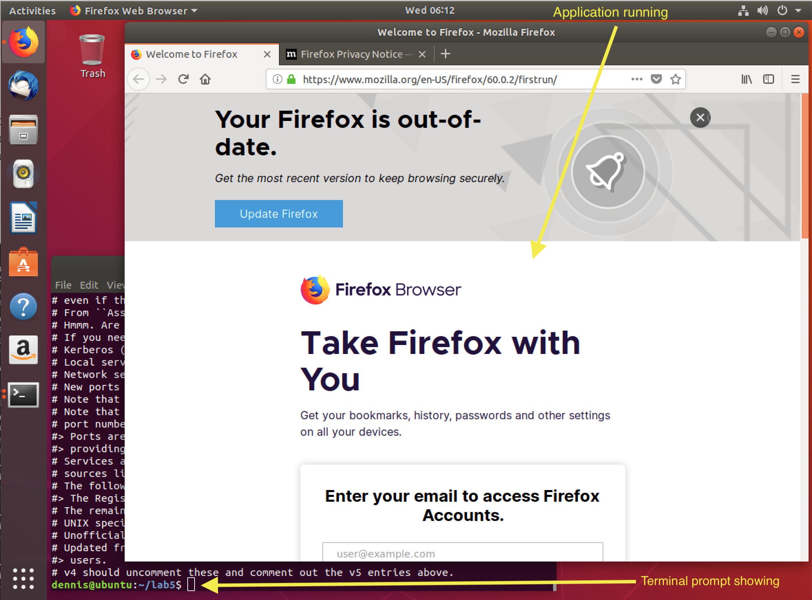

# Lab 2 Locating and running applications on the Linux Desktop

## Overview
For this assignment, you will explore your desktop interface and identify programs used for common Linux desktop tasks. All commands in this lab are to be run using your normal user account only, without the use of sudo or su.

## Task
For each task in the following list, locate and run an application to perform the task. If no application appears to be available that is suitable, use the Software Center application to find and install software. See [the itsfoss desktop software installation page](https://itsfoss.com/remove-install-software-ubuntu/) if you want an overview of using the Software Center application.

* File browser/manager
* Email tool, not a webmail site
* Editor for working with plain text files such as source code, not a document writing tool such as LibreOffice
* Web browser
* Calendar management tool for managing appointments
* Contact manager
* Photo editor for creating and modifying image files, not the Shotwell application
* Video editor for creating and modifying video files, not the Videos application
* Music editor for creating and modifying audio files not the Rhythmbox application
* Document writer
* Spreadsheet creator
* Presentation creator
* Backup tool
* Resource monitor tool
* The system settings tool

## Submission of results

For each application you identify, include a screenshot of the running application, with an open terminal window prompt also visible. An example screenshot is at the end of these instructions. The screenshots must be put into a single pdf file for submission on blackboard. Ensure you do not shrink the images too small to read the terminal prompt.

